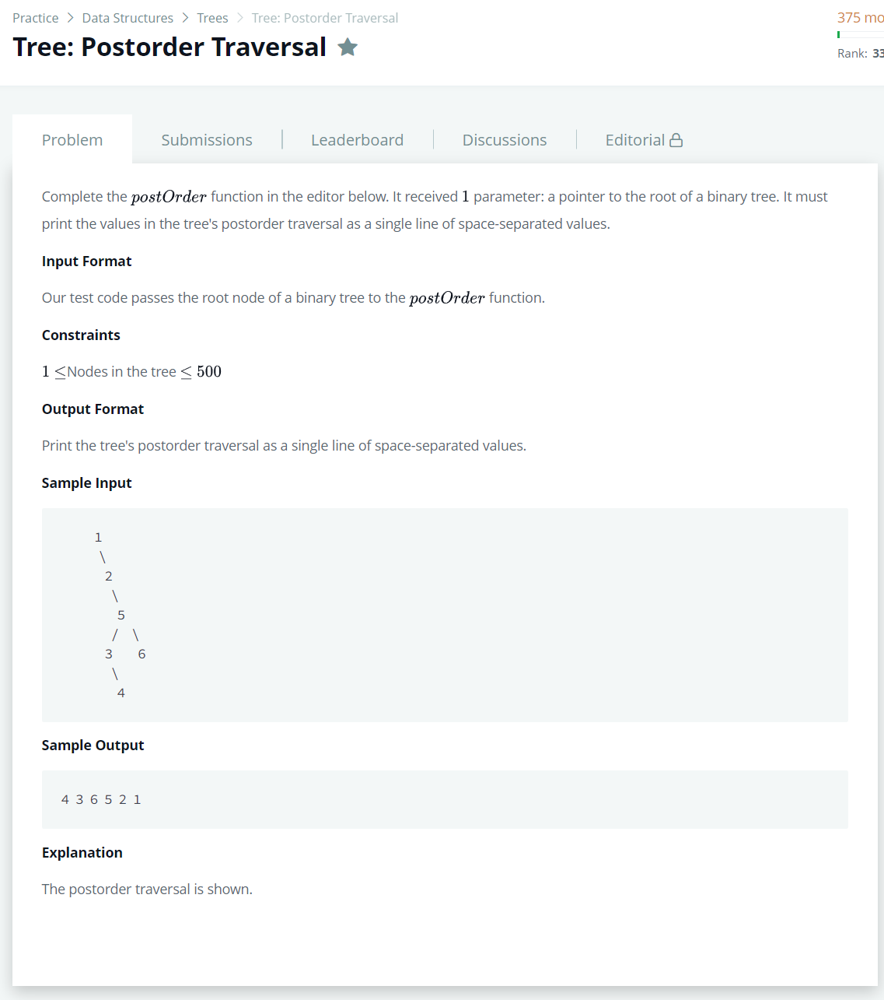

# [Tree : Postorder Traversal](https://www.hackerrank.com/challenges/tree-postorder-traversal/problem)




### My Answer

```python
def postOrder(root):
    if root.left : 
        postOrder(root.left)
    if root.right : 
        postOrder(root.right)
    print(root.info,end=' ')
```

* Time Complexity : O(n)
* Space Complexity : O(n)


### The things I got
