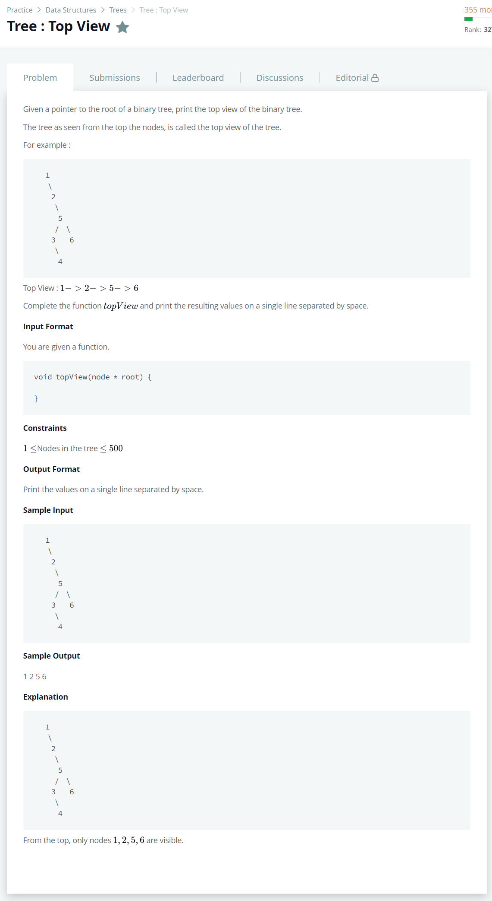

# [Tree: Top View](https://www.hackerrank.com/challenges/tree-top-view/problem)




### My Answer

```python
def traverse(root,direction) : 
    if root.left and direction=='left': 
        traverse(root.left,'left')
    print(root.info,end=' ')
    if root.right and direction=='right':
        #print(root.info,end=' ')
        traverse(root.right,'right')

def topView(root):
    if root.left : 
        traverse(root.left,'left')
    print(root.info,end=' ')
    if root.right : 
        traverse(root.right,'right')
```

* Time Complexity : O(n)
* Space Complexity : O(n)


### The things I got
