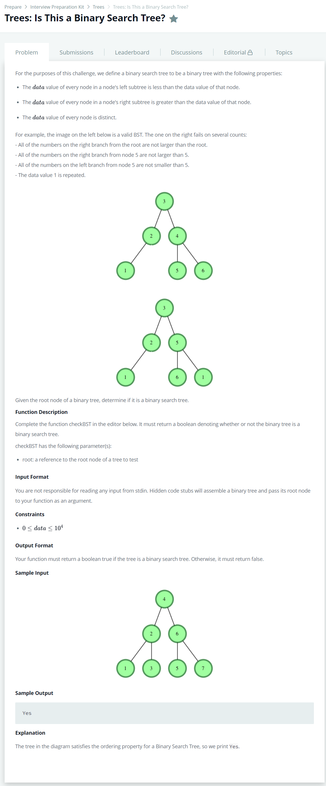

# [Trees: Is This a Binary Search Tree?](https://www.hackerrank.com/challenges/ctci-is-binary-search-tree/problem)




### My Answer

```python
def inOrder(head) : 
    result = []
    if head.left : 
        result+=inOrder(head.left)
    result.append(head.data)
    if head.right : 
        result+=inOrder(head.right)
    return result

def checkBST(root):
    inordered = inOrder(root)
    if inordered==sorted(inordered) and list(set(inordered))==inordered: 
        return True
    else : 
        return False
```

* Time Complexity : O(nlogn)
* Space Complexity : O(n)


### The things I got
