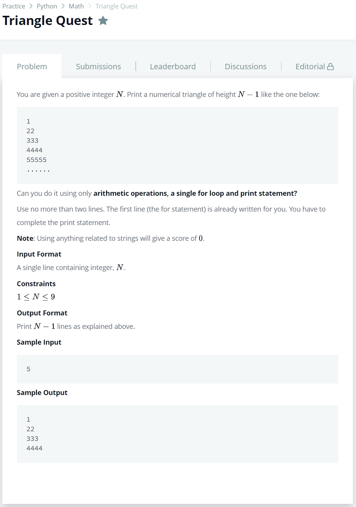

# [Triangle Quest](https://www.hackerrank.com/challenges/python-quest-1/problem)




### My Answer

```python
for i in range(1,int(input())): #More than 2 lines will result in 0 score. Do not leave a blank line also
    print(int(i*(1/9)*(10**i)))
```

* Time Complexity : O(n)
* Space Complexity : O(1)


### The things I got
