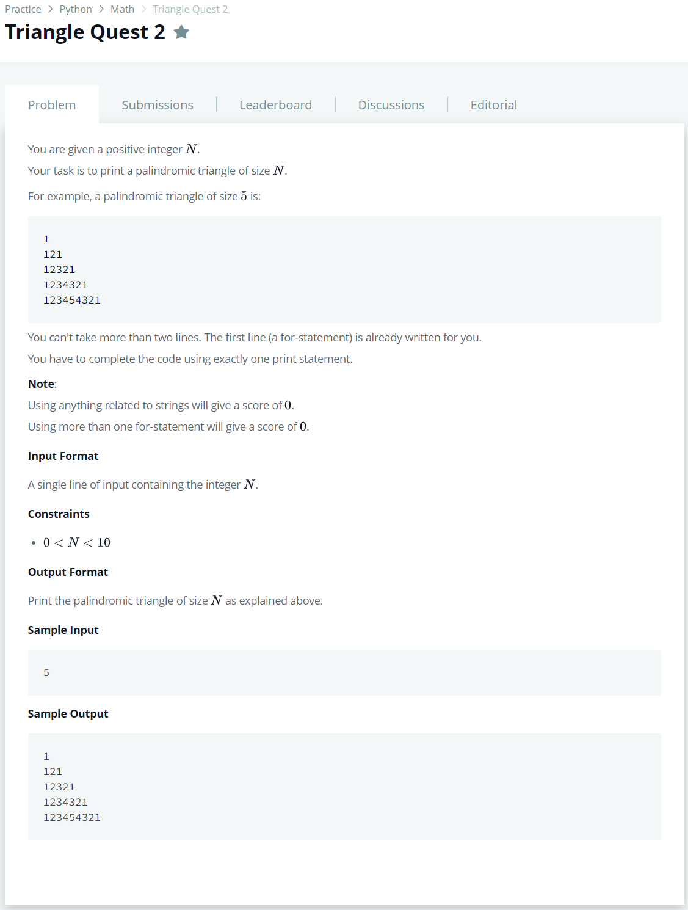

# [Triangle Quest 2](https://www.hackerrank.com/challenges/triangle-quest-2/problem?h_r=next-challenge&h_v=zen)




### My Answer

```python
for i in range(1,int(input())+1): #More than 2 lines will result in 0 score. Do not leave a blank line also
    print(sum(list(map(lambda x : x*(10**(2*i-x-1)),range(1,i+1)))+list(map(lambda x : x*(10**(x-1)),range(i-1,0,-1)))))
```

* Time Complexity : O(n)
* Space Complexity : O(1)


### The things I got
