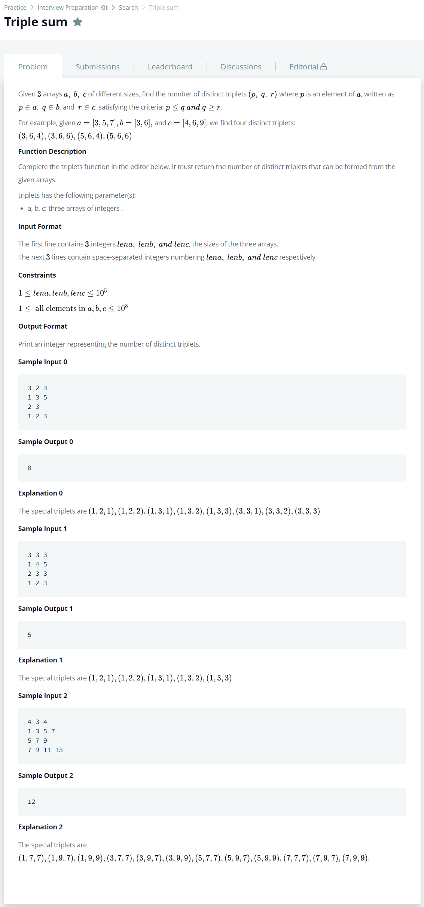

# [Triple Sum](https://www.hackerrank.com/challenges/triple-sum/problem)




### My Answer

```python
def triplets(a, b, c):
    count_dic = defaultdict(list)
    for x1 in a : 
        count_dic[x1].append('a')
    for x2 in b : 
        count_dic[x2].append('b')
    for x3 in c : 
        count_dic[x3].append('c')   
  
    a_count=0
    c_count=0
    total_count=0
    
    for v in sorted(count_dic) : 
        items = count_dic[v]
        if 'a' in items : 
            a_count+=1
        if 'c' in items : 
            c_count+=1
        if 'b' in items : 
            total_count+=a_count*c_count
            
    return total_count
```

* Time Complexity : O(p+q+r)
* Space Complexity : O(p+q+r)


### The things I got
