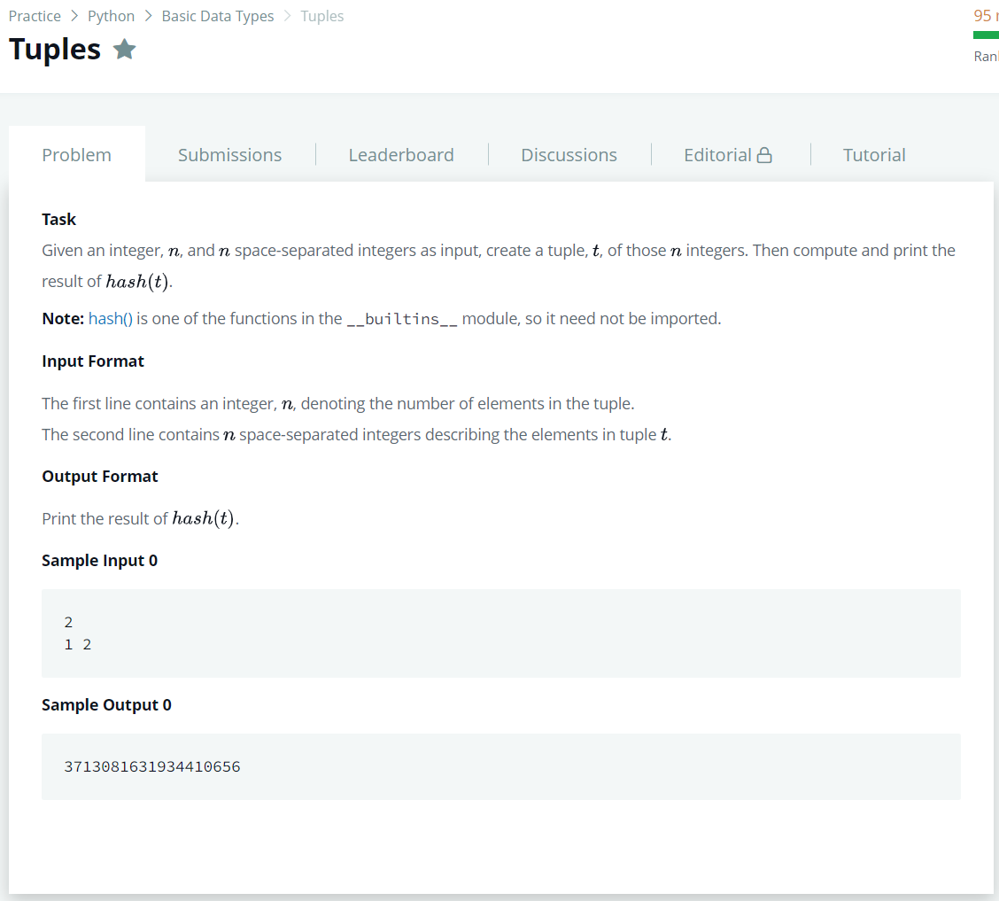

# [Tuples](https://www.hackerrank.com/challenges/python-tuples/problem)




### My Answer

```python
if __name__ == '__main__':
    n = int(input())
    integer_list = map(int, input().split())
    print(hash(tuple(integer_list)))
```

* Time Complexity : O(n)
* Space Complexity : O(n)


### The things I got
