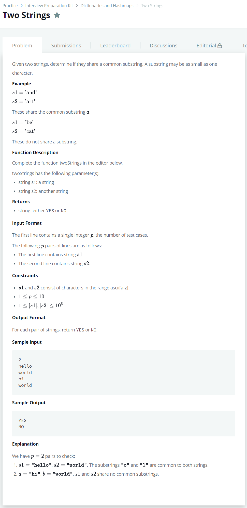

# [Two Strings](https://www.hackerrank.com/challenges/two-strings/problem?h_l=interview&playlist_slugs%5B%5D=interview-preparation-kit&playlist_slugs%5B%5D=dictionaries-hashmaps)




### My Answer

```python
def twoStrings(s1, s2):
    hashmap = defaultdict(int)
    for x in s1 : 
        hashmap[x]=1
    for y in s2 : 
        if hashmap[y]==1 : 
            return 'YES'
    return 'NO'
```

* Time Complexity : O(2n)
* Space Complexity : O(2n)


### The things I got
