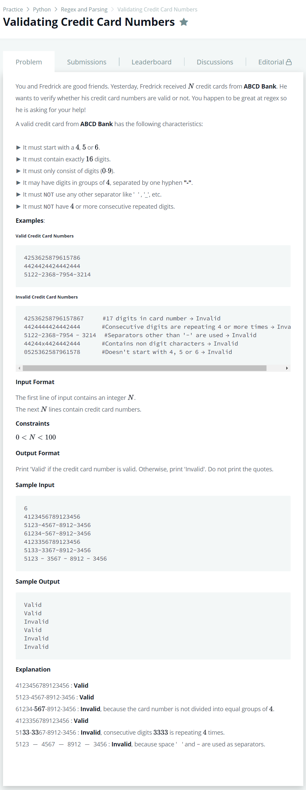

# [Validating Credit Card Numbers](https://www.hackerrank.com/challenges/validating-credit-card-number/problem)




### My Answer

```python
import re

for _ in range(int(input())) : 
    numbers = input()
    try : 
        assert re.match(r'(^[456][0-9]{15})$|^([456][0-9]{3}-[0-9]{4}-[0-9]{4}-[0-9]{4}$)',numbers)
        assert not re.search(r'([0-9])-?\1-?\1-?\1',numbers)
        print('Valid')
    except : 
        print('Invalid')
```

* Time Complexity : O(1)
* Space Complexity : O(1)


### The things I got
