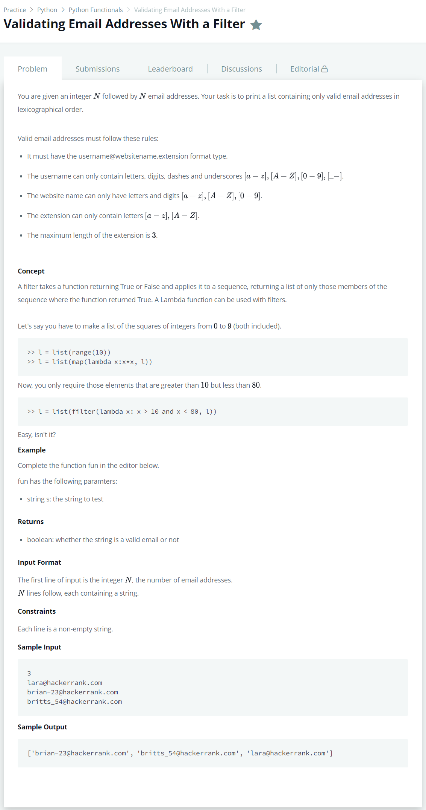

# [Validating Email Addresses With a Filter](https://www.hackerrank.com/challenges/validate-list-of-email-address-with-filter/problem)




### My Answer

```python
import re

def fun(s):
  pattern = re.compile("^[\\w-]+@[0-9a-zA-Z]+\\.[a-z]{1,3}$")
  return pattern.match(s)

def filter_mail(emails):
    return list(filter(fun, emails))

if __name__ == '__main__':
    n = int(input())
    emails = []
    for _ in range(n):
        emails.append(input())

filtered_emails = filter_mail(emails)
filtered_emails.sort()
print(filtered_emails)
```

* Time Complexity : O(1)
* Space Complexity : O(1)


### The things I got
