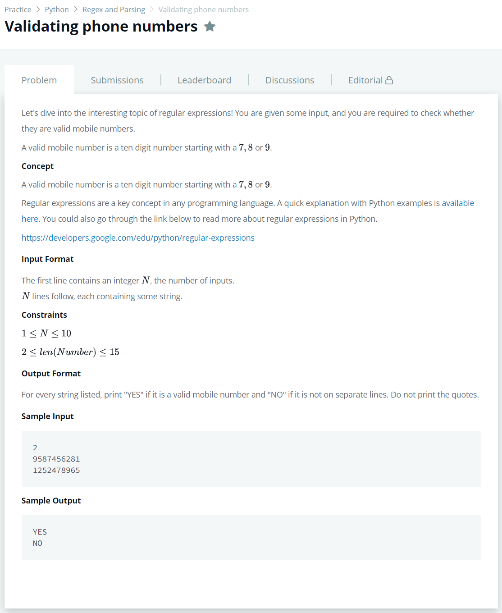

# [Validating Phone Numbers](https://www.hackerrank.com/challenges/validating-the-phone-number/problem)




### My Answer

```python
import re
for _ in range(int(input())) : 
    print("YES" if re.match(r'^[7-9][0-9]{9}$',input()) else "NO")
```

* Time Complexity : O(1)
* Space Complexity : O(1)


### The things I got
