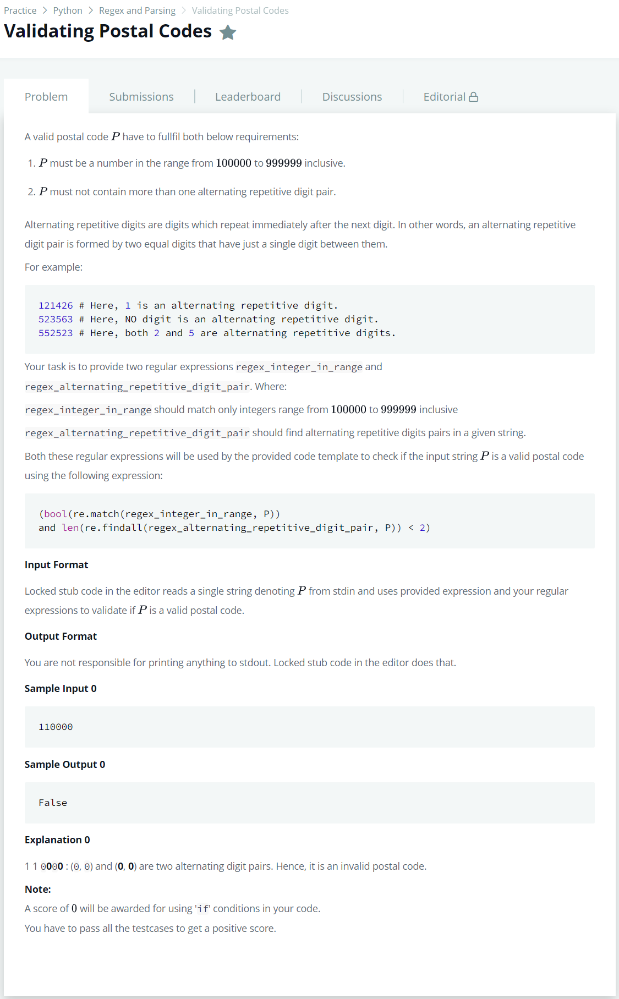

# [Validating Postal Codes](https://www.hackerrank.com/challenges/validating-postalcode/problem)




### My Answer

```python
regex_integer_in_range = r"^[1-9][0-9]{5}$"	# Do not delete 'r'.
regex_alternating_repetitive_digit_pair = r"([0-9])(?=.\1)"	# Do not delete 'r'.
```

* Time Complexity : O(1)
* Space Complexity : O(1)


### The things I got
