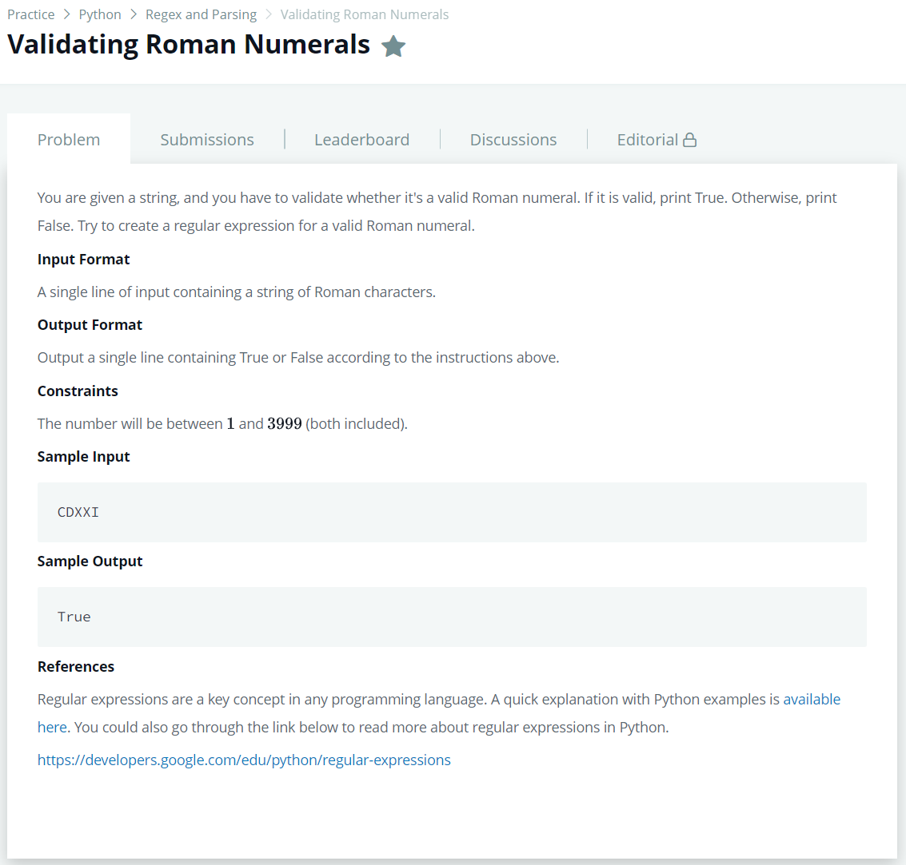

# [Validating Roman Numerals](https://www.hackerrank.com/challenges/validate-a-roman-number/problem)




### My Answer

```python
regex_pattern = r"M{0,3}(D?C{0,3}|C[CDM]C?)(L?X{0,3}|X[XLC]X?)(V?I{0,3}|I[IVX]I?)$"	# Do not delete 'r'.

import re
print(str(bool(re.match(regex_pattern, input()))))
```

* Time Complexity : O(1)
* Space Complexity : O(1)


### The things I got
