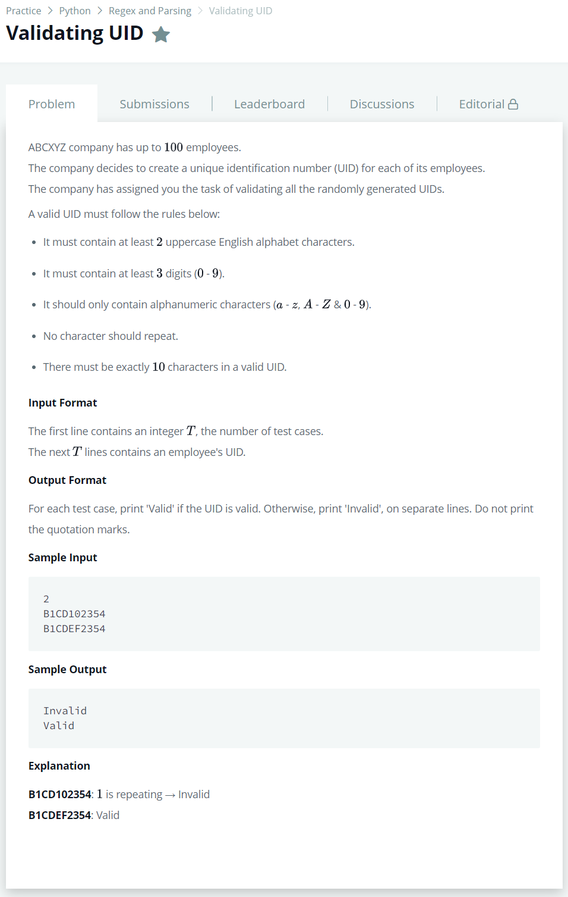

# [Validating UID](https://www.hackerrank.com/challenges/validating-uid/problem)




### My Answer

```python
import re

for _ in range(int(input())) : 
    UID = input().strip()
    A = re.search(r'([A-Z].*){2}',UID)
    B = re.search(r'([0-9].*){3}',UID)
    C = re.search(r'[a-zA-Z0-9]{10}',UID)
    D = not re.search(r'.*([a-zA-Z0-9]).*\1',UID)
    
    print('Valid' if all([A,B,C,D]) else 'Invalid')
```

* Time Complexity : O(4n)
* Space Complexity : O(n)


### The things I got
