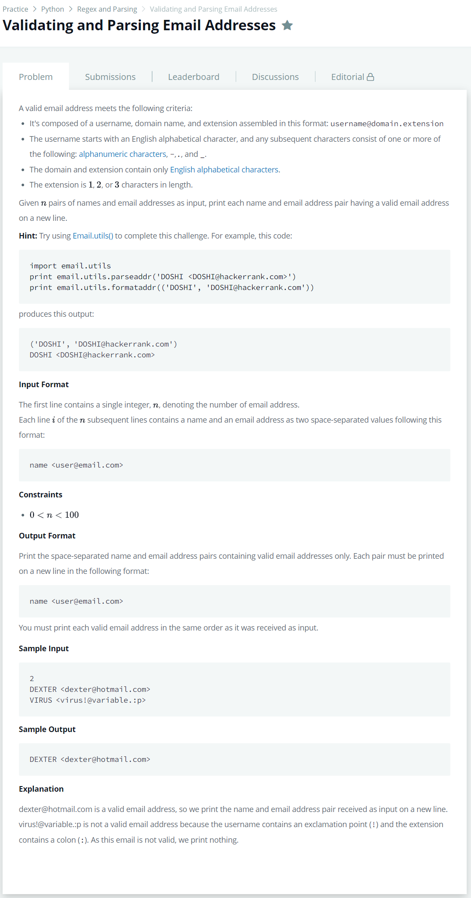

# [Validating and Parsing Email Addresses](https://www.hackerrank.com/challenges/validating-named-email-addresses/problem)




### My Answer

```python
import re
for _ in range(int(input())) : 
    name, email = input().split(' ')
    match = re.match(r'^[a-zA-Z]'+'[a-zA-Z0-9\-\.\_]*@[a-zA-Z]+\.[a-zA-Z]{1,3}$',email[1:-1])
    if match : print(name,email)
```

* Time Complexity : O(1)
* Space Complexity : O(1)


### The things I got
