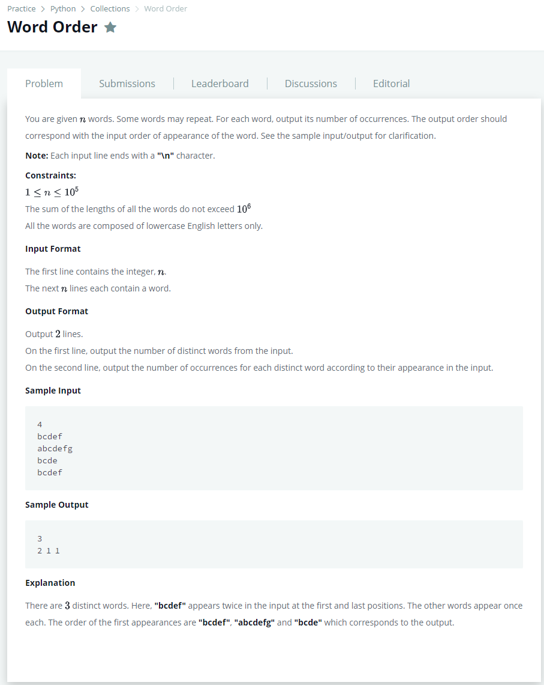

# [Word Order](https://www.hackerrank.com/challenges/word-order/problem)

  

### My Answer

```python
from collections import defaultdict

distinct = defaultdict(int)
for x in [input() for _ in range(int(input()))] : 
    distinct[x]+=1
    
print(len(distinct))
print(*distinct.values())

```

* Time Complexity : O(n)
* Space Complexity : O(n)


### The things I got

