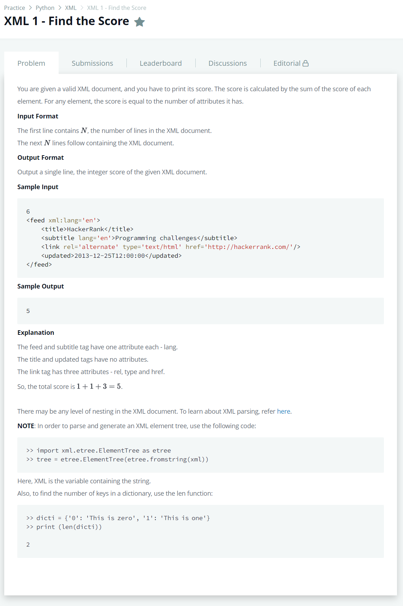

# [XML 1 - Find the Score](https://www.hackerrank.com/challenges/xml-1-find-the-score/problem)




### My Answer

```python
import sys
import xml.etree.ElementTree as etree

def get_attr_number(node):
    return sum(len(child.attrib) for child in node.iter())
```

* Time Complexity : O(1)
* Space Complexity : O(1)


### The things I got
