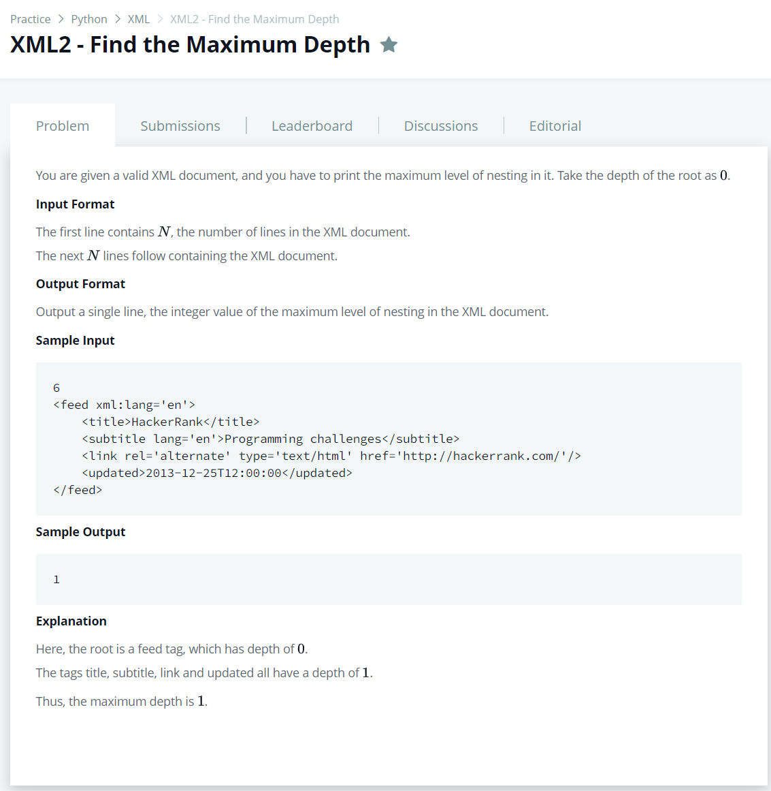

# [XML2 - Find the Maximum Depth](https://www.hackerrank.com/challenges/xml2-find-the-maximum-depth/problem)




### My Answer

```python
import xml.etree.ElementTree as etree

maxdepth = 0
def depth(elem, level):
    global maxdepth
    level += 1
    if level >= maxdepth:
        maxdepth = level
    for child in elem:
        depth(child, level)


if __name__ == '__main__':
```

* Time Complexity : O(1)
* Space Complexity : O(1)


### The things I got
