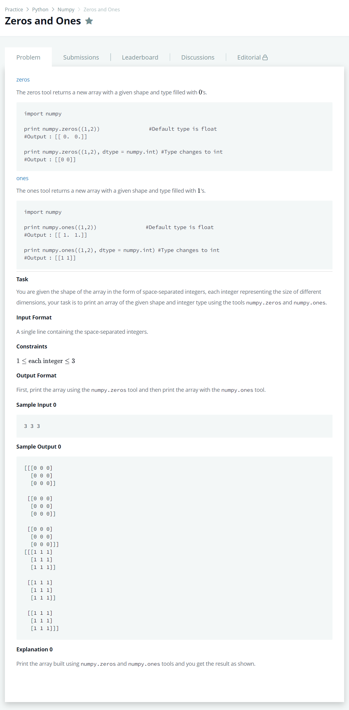

# [Zeros And Ones](https://www.hackerrank.com/challenges/np-zeros-and-ones/problem)




### My Answer

```python
import numpy as np

size = tuple([int(x) for x in input().split(' ')])
print(np.zeros(size,dtype=int))
print(np.ones(size,dtype=int))
```

* Time Complexity : O(1)
* Space Complexity : O(1)


### The things I got
