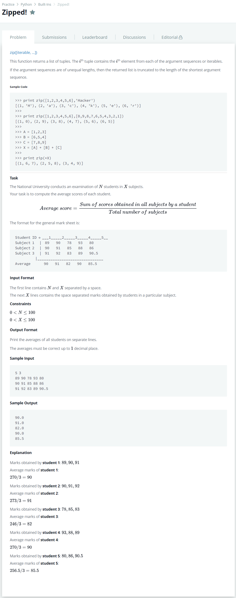

# [Zipped!](https://www.hackerrank.com/challenges/zipped/problem)




### My Answer

```python
for x in zip(*[input().split(' ') for _ in range(int(input().split(' ')[1]))]) : 
    k = list(map(lambda y : float(y),x))
    print('%.1f'%(sum(k)/len(k)))
```

* Time Complexity : O(n)
* Space Complexity : O(n)


### The things I got
