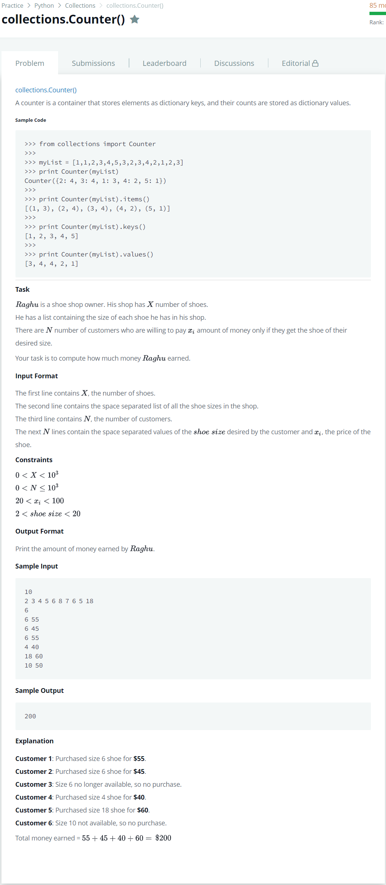

# [collections Counter](https://www.hackerrank.com/challenges/collections-counter/problem?isFullScreen=true)




### My Answer

```python
import sys
from collections import Counter

_ = sys.stdin.readline()
collection = Counter(sys.stdin.readline()[:-1].split(' '))
n = int(sys.stdin.readline())

total_price=0
for i in range(n) : 
    shoe_size, price = sys.stdin.readline().split(' ')
    if collection[shoe_size] > 0 : 
        collection.subtract([shoe_size])
        total_price += int(price)
        
print(total_price)
```

* Time Complexity : O(n)
* Space Complexity : O(n)


### The things I got
