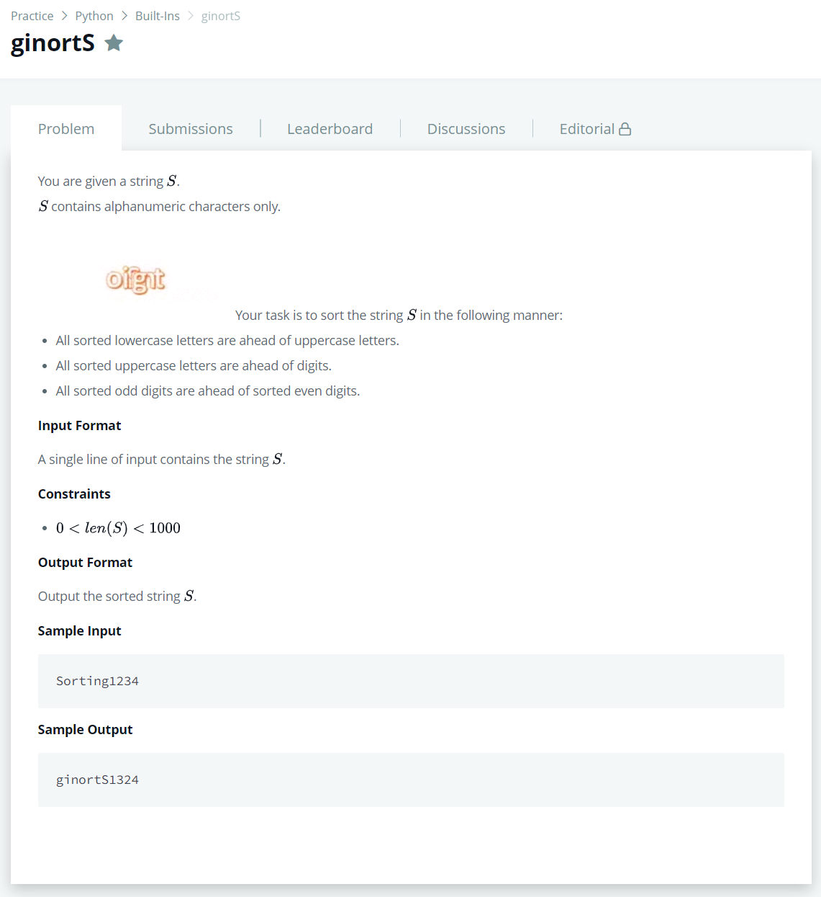

# [ginortS](https://www.hackerrank.com/challenges/ginorts/problem)




### My Answer

```python
string = list(input())
lower,upper,odd,even = [],[],[],[]

for x in string : 
    if x.islower() : lower.append(x)
    elif x.isupper() : upper.append(x)
    elif x.isdigit() : 
        if int(x)%2==1 : odd.append(x)
        else : even.append(x)
    
print(''.join(sorted(lower)+sorted(upper)+sorted(odd)+sorted(even)))
```

* Time Complexity : O(n)
* Space Complexity : O(n)


### The things I got
