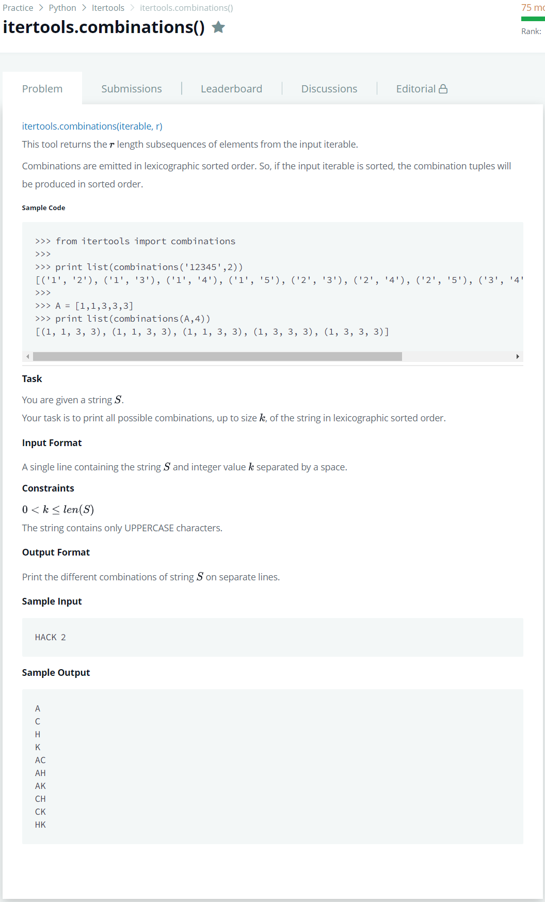

# [itertools Combinations](https://www.hackerrank.com/challenges/itertools-combinations/problem)




### My Answer

```python
import sys
from itertools import combinations

word, length = sys.stdin.readline().split(' ')
for i in range(1,int(length)+1) : 
    for j in sorted(list(combinations(sorted(word),i))) : 
        print(''.join(j))
```

* Time Complexity : O(n)
* Space Complexity : O(1)


### The things I got
