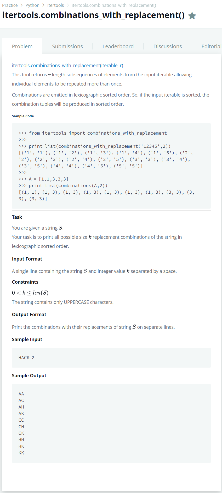

# [itertools Combinations_with_replacement()](https://www.hackerrank.com/challenges/itertools-combinations-with-replacement/problem)




### My Answer

```python
from itertools import combinations_with_replacement

s, k = input().split()

for c in combinations_with_replacement(sorted(s), int(k)):
    print("".join(c))
```

* Time Complexity : O(n)
* Space Complexity : O(n)


### The things I got
