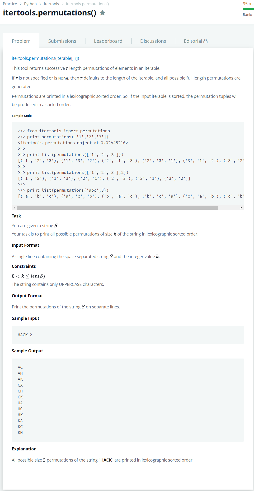

# [itertools Permutations](https://www.hackerrank.com/challenges/itertools-permutations/problem)




### My Answer

```python
# Enter your code here. Read input from STDIN. Print output to STDOUT
import sys
from itertools import permutations

word, size = sys.stdin.readline().split(' ')
for x in sorted(list(permutations([x for x in word],r=int(size)))) : 
    print(''.join(x))
```

* Time Complexity : O(n)
* Space Complexity : O(1)


### The things I got
