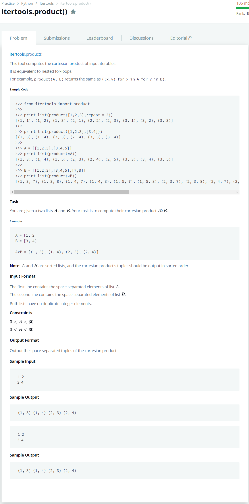

# [itertools.Product](https://www.hackerrank.com/challenges/itertools-product/problem)




### My Answer

```python
import sys

A = sys.stdin.readline()[:-1].split(' ')
B = sys.stdin.readline().split(' ')

for a in A : 
    for b in B : 
        print('({}, {}) '.format(a, b),end='')

```

* Time Complexity : O(n)
* Space Complexity : O(1)


### The things I got
