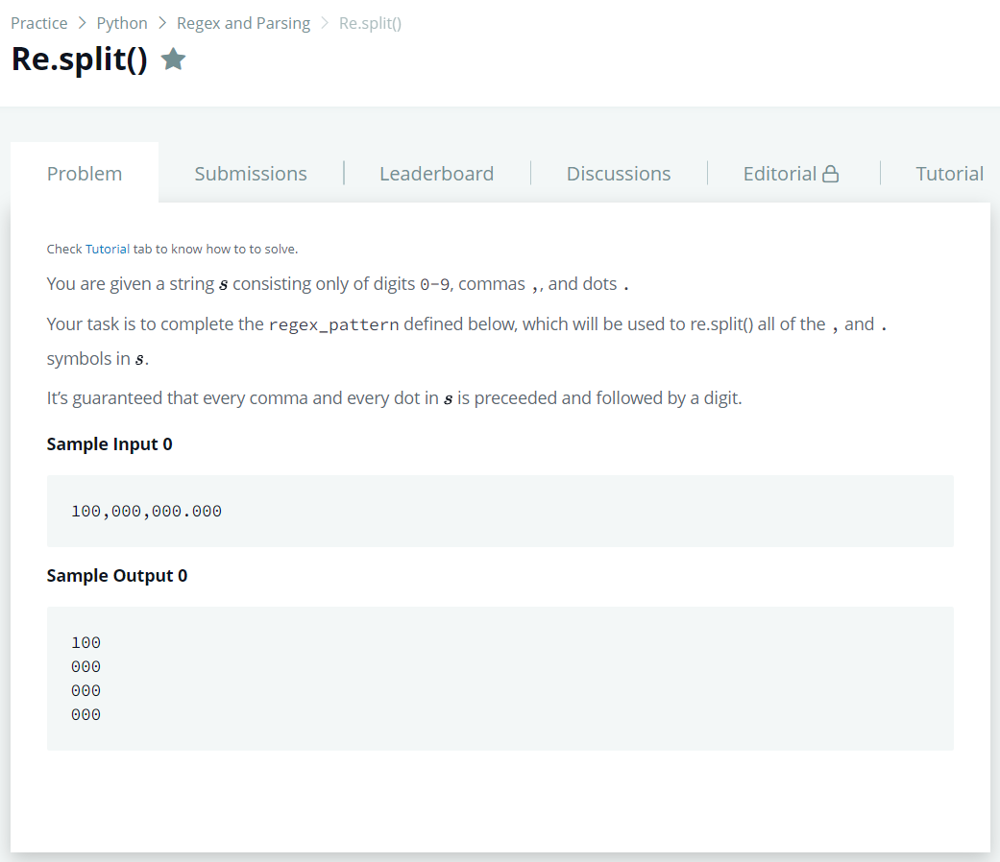

# [re.split()](https://www.hackerrank.com/challenges/re-split/problem)




### My Answer

```python
regex_pattern = r"[,.]"
```

* Time Complexity : O(1)
* Space Complexity : O(1)


### The things I got
