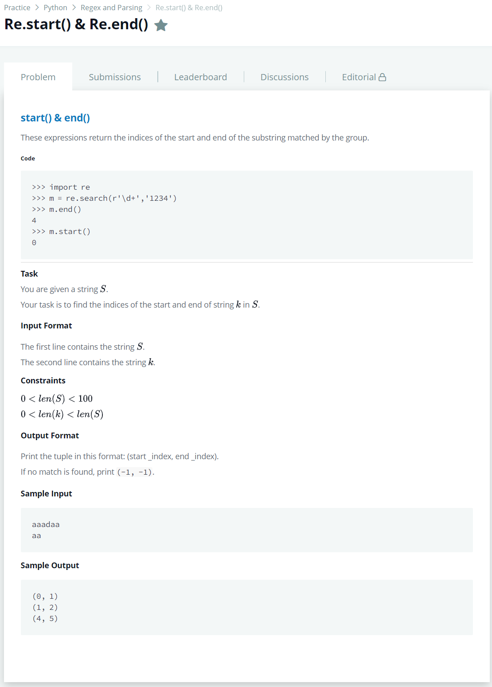

# [Re.start() & Re.end()](https://www.hackerrank.com/challenges/re-start-re-end/problem)




### My Answer

```python
import re
string = input()
pattern = input().strip()
if pattern not in string : 
    print((-1,-1))
else : 
    for x in re.finditer(r'(?='+pattern+')',string) : 
        print((x.start(),x.end()+len(pattern)-1))
```

* Time Complexity : O(1)
* Space Complexity : O(1)


### The things I got
