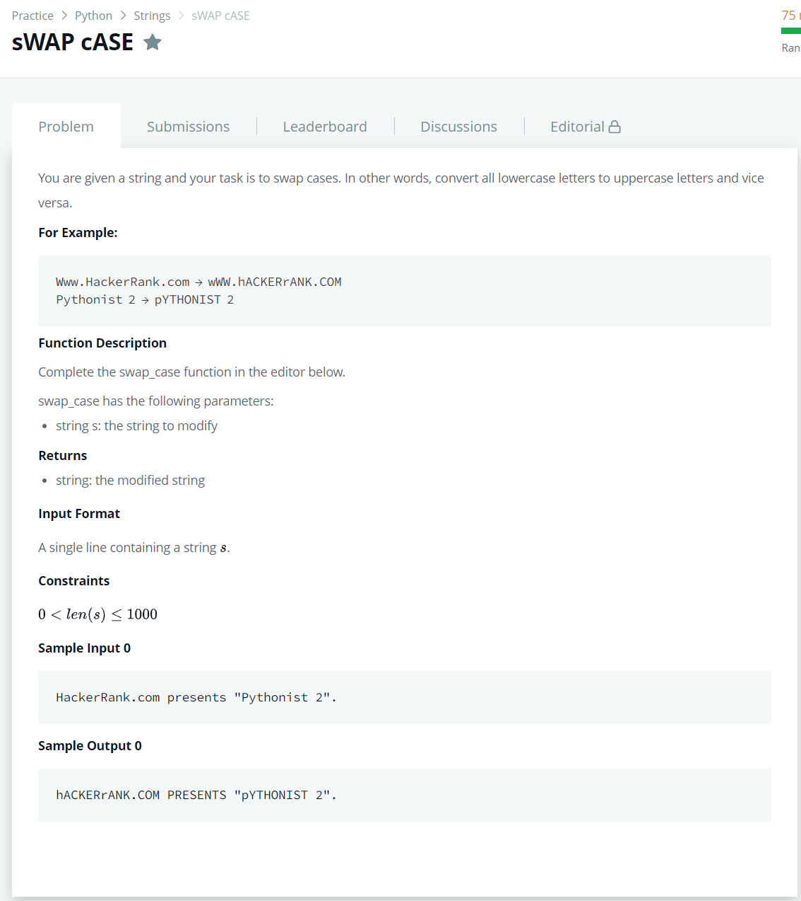

# [sWAP cASE](https://www.hackerrank.com/challenges/swap-case/problem)




### My Answer

```python
def swap_case(s):
    return ''.join([x.upper() if x==x.lower() else x.lower() for x in s])
```

* Time Complexity : O(n)
* Space Complexity : O(n)


### The things I got
