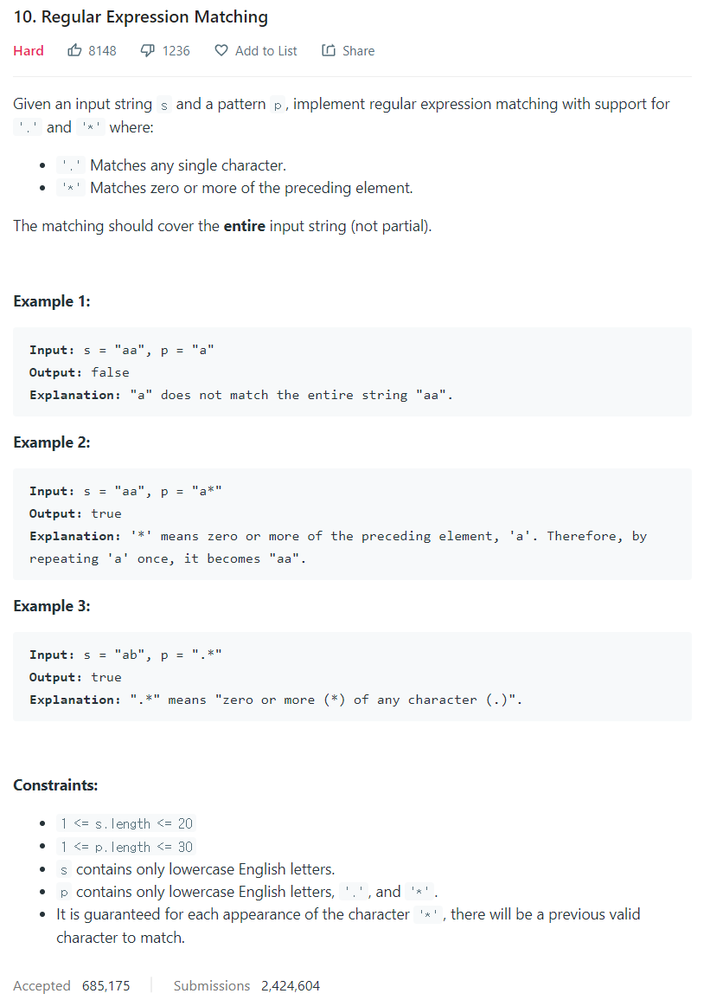

# [10. Regular Expression Matching](https://leetcode.com/problems/regular-expression-matching/)




### My Answer

```python
def isMatch(self, s: str, p: str) -> bool:
        D = dict()
        
        def recur(s,p) : 
            #print("s : {}, p : {}".format(s,p))
            #print("D :",D)
            if (s,p) in D : return D[(s,p)]
            while s and p and (s[-1]==p[-1] or p[-1]=='.') : 
                s=s[:-1]
                p=p[:-1]
            #print("s : {}, p : {}".format(s,p))
            if not s and not p : 
                D[(s,p)]=1
                return True
            elif not (s and p) :
                if len(p)>1 and p[-1]=='*' : 
                    temp = recur(s,p[:-2])
                    D[(s,p[:-2])]=temp
                    return temp
                else : 
                    D[(s,p)]=0
                    return False
            elif p[-1].isalpha() :
                if s[-1]!=p[-1] : 
                    D[(s,p)]=0
                    return False
                else : 
                    temp = recur(s[:-1],p[:-1])
                    D[(s[:-1],p[:-1])]=temp
                    return temp
            else :  # p[-1]=='*'
                a,b,c,d = 0,0,0,0
                if p[-2] in ('.',s[-1]) : 
                    a = recur(s[:-1],p[:-1])
                    D[(s[:-1],p[:-1])]=a
                    b = recur(s[:-1],p)
                    D[(s[:-1],p)]=b
                    c = recur(s,p[:-1])
                    D[(s,p[:-1])]=c
                d = recur(s,p[:-2])
                D[(s,p[:-2])]=d
                return a | b | c | d
        return recur(s,p)
```

* Time Complexity : O(n^2)
* Space Complexity : O(n^2)


### The things I got
