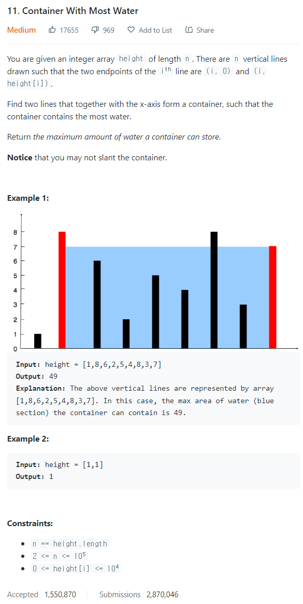

# [11. Container With Most Water](https://leetcode.com/problems/container-with-most-water/)




### My Answer

```python
class Solution:
    def maxArea(self, height):
        i, j = 0, len(height) - 1
        water = 0
        while i < j:
            water = max(water, (j - i) * min(height[i], height[j]))
            if height[i] < height[j]:
                i += 1
            else:
                j -= 1
        return water
```

* Time Complexity : O(n)
* Space Complexity : O(n)


### The things I got
