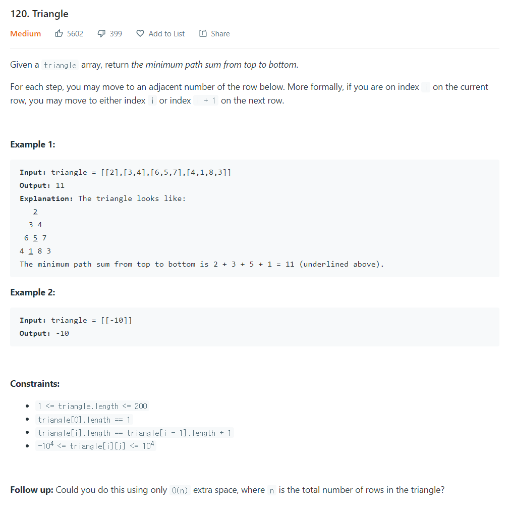

# [1. Two Sum](https://leetcode.com/problems/two-sum/)




### My Answer

```python
class Solution:
    def minimumTotal(self, triangle: List[List[int]]) -> int:
        dp = [[0 for _ in range(r+1)] for r in range(len(triangle[-1]))]
        dp[0]=triangle[0]
        for i in range(1,len(triangle)) : 
            for j in range(i+1) : 
                if 0<j<i : 
                    dp[i][j]=min(dp[i-1][j-1],dp[i-1][j])+triangle[i][j]
                elif j==0 : 
                    dp[i][j]=dp[i-1][j]+triangle[i][j]
                elif j==i : 
                    dp[i][j]=dp[i-1][j-1]+triangle[i][j]
                else : 
                    raise(Exception("Wrong index!"))
                    break
        return min(dp[-1])
            
```

* Time Complexity : O(n^2)
* Space Complexity : O(n^2)


### The things I got
