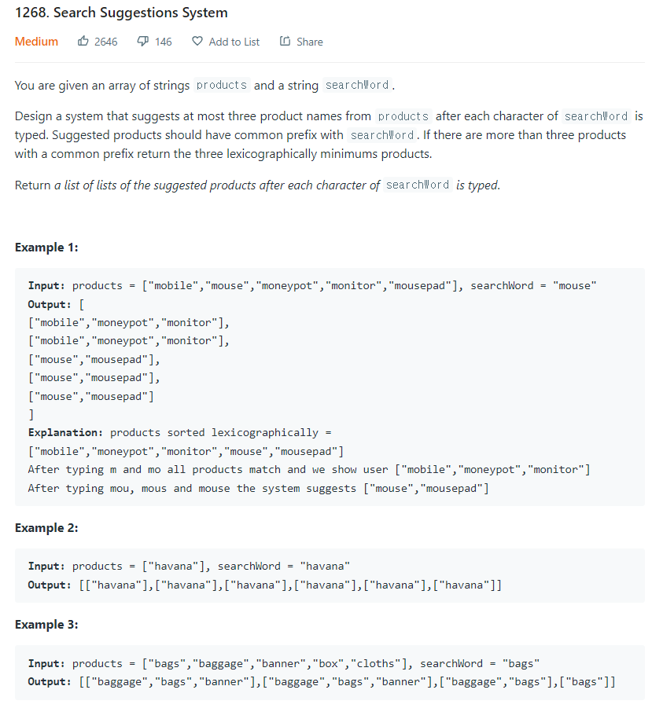

# [1268. Search Suggestions System](https://leetcode.com/problems/search-suggestions-system/)




### My Answer

```python
 def suggestedProducts(self, A, word):
        A.sort()
        res, prefix, i = [], '', 0
        for c in word:
            prefix += c
            i = bisect.bisect_left(A, prefix, i)
            res.append([w for w in A[i:i + 3] if w.startswith(prefix)])
        return res
```

* Time Complexity : O(nlogn)
* Space Complexity : O(logn)


### The things I got
