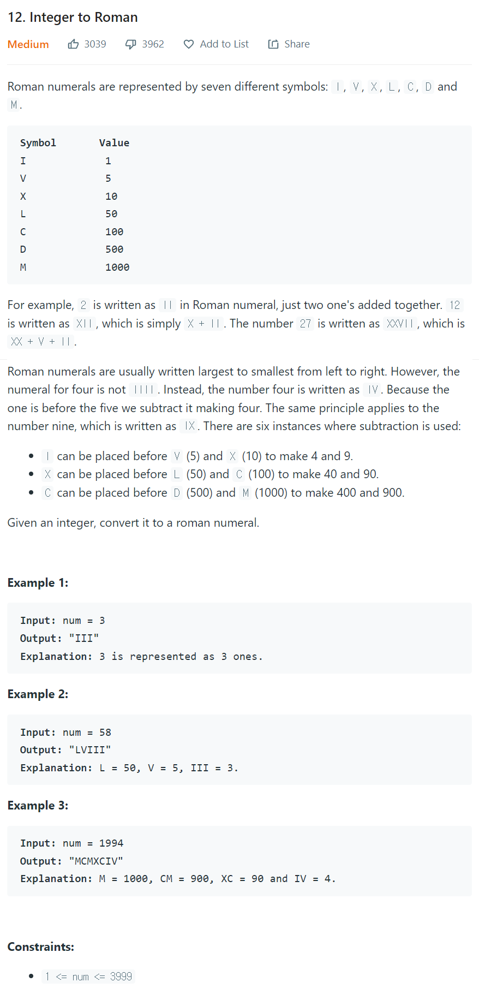

# [12. Integer To Roman](https://leetcode.com/problems/integer-to-roman/)




### My Answer

```python
class Solution:
    def intToRoman(self, num: int) -> str:
        symbols = {1:["I","V"],10:["X","L"],100:["C","D"],1000:"M"}
        result = ''
        i=1
        
        while num : 
            temp=''
            div = num%10
            
            if div==9 : 
                temp+=symbols[i][0]+symbols[i*10][0]
            elif div==4 : 
                temp+=symbols[i][0]+symbols[i][1]    
            else : 
                if div//5==1 : 
                    temp+=symbols[i][1]
                for j in range(div%5) : 
                    temp+=symbols[i][0]
            result=temp+result
            
            num = num//10
            i*=10
            
        return result
```

* Time Complexity : O(log(n))
* Space Complexity : O(log(n))


### The things I got
