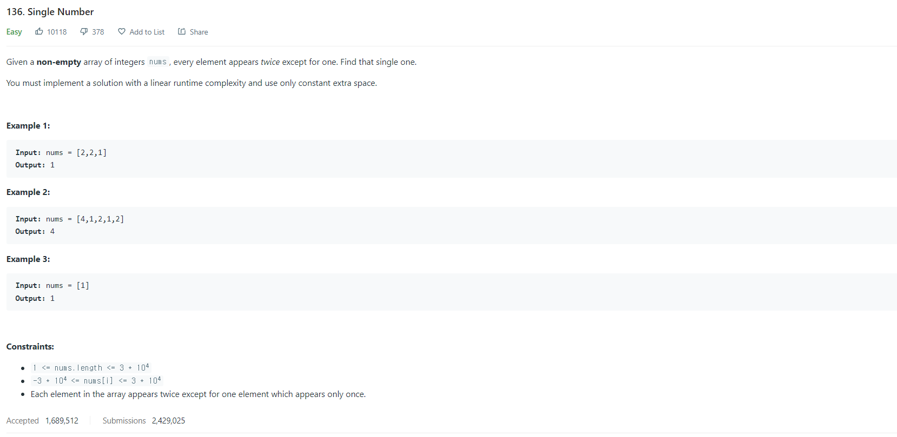

# [136. SingleNumber](https://leetcode.com/problems/single-number/)




### My Answer

```python
class Solution:
    def singleNumber(self, nums: List[int]) -> int:
        xor = 0
        for num in nums:
            xor ^= num
        
        return xor
```

* Time Complexity : O(n)
* Space Complexity : O(1)


### The things I got
