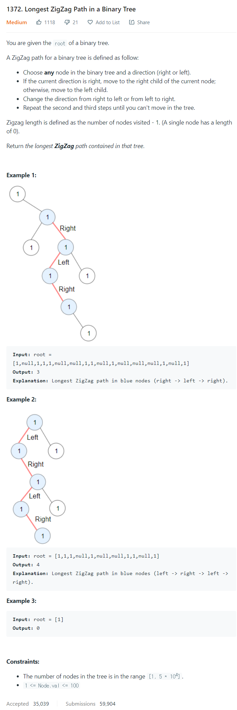

# [1372. Longest ZigZag Path in a Binary Tree](https://leetcode.com/problems/longest-zigzag-path-in-a-binary-tree/)




### My Answer

```python
def longestZigZag(self, root):
    def dfs(root):
        if not root: return [-1, -1, -1]
        left, right = dfs(root.left), dfs(root.right)
        return [left[1] + 1, right[0] + 1, max(left[1] + 1, right[0] + 1, left[2], right[2])]
    return dfs(root)[-1]
```

* Time Complexity : O(n)
* Space Complexity : O(height)


### The things I got

오브젝트대신 (고정)리스트를 사용한다는 점이 놀랐다.. 내가 생각하던 알고리즘이랑은 같았지만 구현방법이 이렇게 깔끔하다는 것에 크게 놀람. 이런 유형이 나온다면 꼭 짚어보자  

 