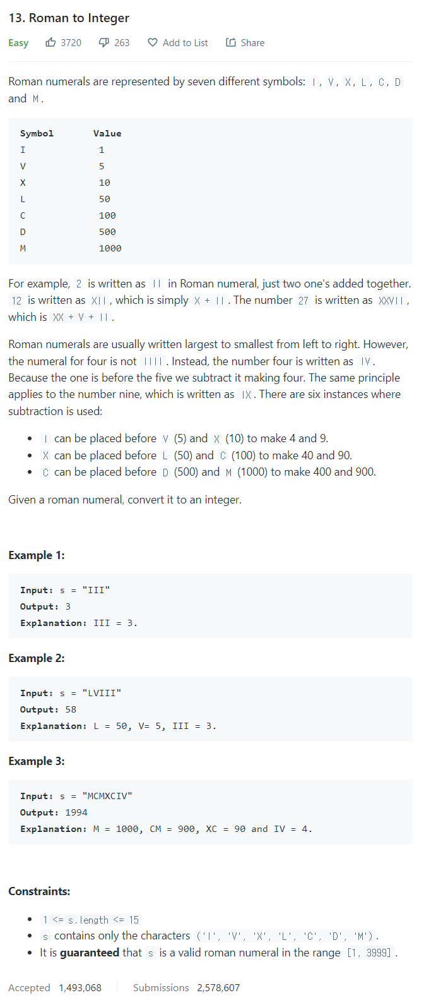

# [13. Roman to Integer](https://leetcode.com/problems/roman-to-integer/)




### My Answer

```python
class Solution:
    def romanToInt(self, s: str) -> int:
        #mapping : {'symbol' : (priority, value)}
        mapping = {'I':(7,1),'V':(6,5),'X':(5,10),'L':(4,50),'C':(3,100),'D':(2,500),'M':(1,1000)}
        
        total = 0
        for i,x in enumerate(s[:-1]) : 
            priority, value = mapping[x]
            if  priority > mapping[s[i+1]][0] : 
                value=value*-1
            total+=value
        total+=mapping[s[-1]][1]
        
        return total
            
```

* Time Complexity : O(n)
* Space Complexity : O(n)


### The things I got
