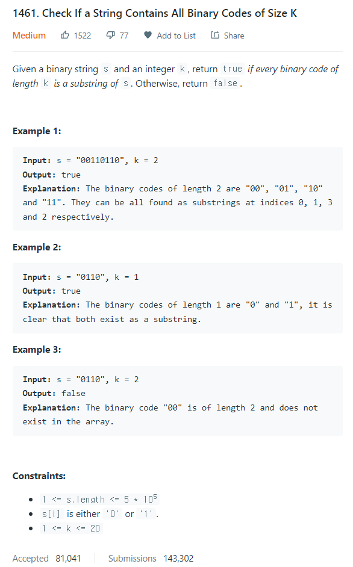

# [1461. Check If a String Contains All Binary Codes of Size K](https://leetcode.com/problems/check-if-a-string-contains-all-binary-codes-of-size-k/)




### My Answer

```python
def hasAllCodes(self, s: str, k: int) -> bool:
        contain = set()
        for i in range(len(s)-k+1) : 
            contain.add(s[i:i+k])
        return True if len(contain)>=2**k else False
```

* Time Complexity : O(n)
* Space Complexity : O(n)


### The things I got
