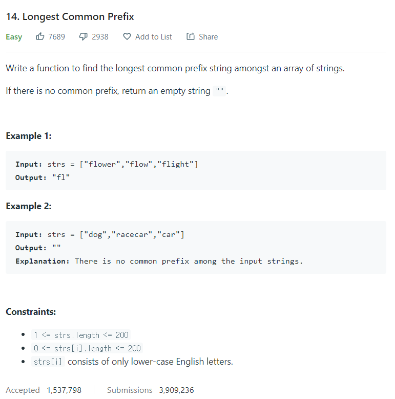

# [14. Longest Common Prefix](https://leetcode.com/problems/longest-common-prefix/)




### My Answer

```python
class Solution:
    def longestCommonPrefix(self, strs: List[str]) -> str:
        result = ""
        for x in zip(*strs) : 
            if len(set(x))==1 : 
                result+=x[0]
            else : 
                break
        return result
```

* Time Complexity : O(n)
* Space Complexity : O(n)


### The things I got
