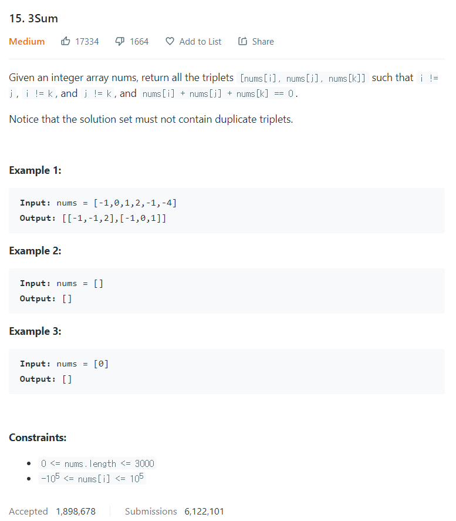

# [15. 3Sum](https://leetcode.com/problems/3sum/)




### My Answer

```python
def threeSum(self, nums: List[int]) -> List[List[int]]:
        from collections import defaultdict
        
        d = defaultdict(int)
        for x in nums : 
            d[str(x)]=1
        
        results = []
        num.sort()
        l,m,r = 0,len(num)//2,len(num)-1
        while l<m and m<r : 
            m = 0-num[l]-num[r]
            if d[m]==1 : 
                results.append([l,m,r])
                        
        return results
```

* Time Complexity : O(n^2)
* Space Complexity : O(n)


### The things I got
