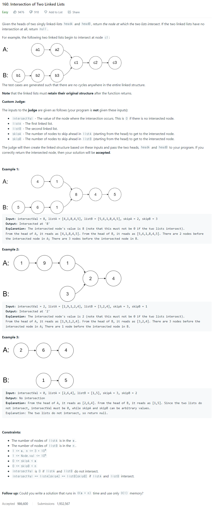

# [160. Intersection of Two Linked Lists](https://leetcode.com/problems/intersection-of-two-linked-lists/)




### My Answer

```python
def getIntersectionNode(self, headA: ListNode, headB: ListNode) -> Optional[ListNode]:
        stackA,stackB = [], []
        while headA : 
            stackA.append(headA)
            headA = headA.next
        while headB : 
            stackB.append(headB)
            headB = headB.next
        
        prev = None
        while stackA and stackB : 
            if stackA[-1] != stackB[-1] : 
                return prev
            else : 
                prev = stackA[-1]
                stackA.pop()
                stackB.pop()
        return prev
```

* Time Complexity : O(a+b)
* Space Complexity : O(a+b)


### The things I got
