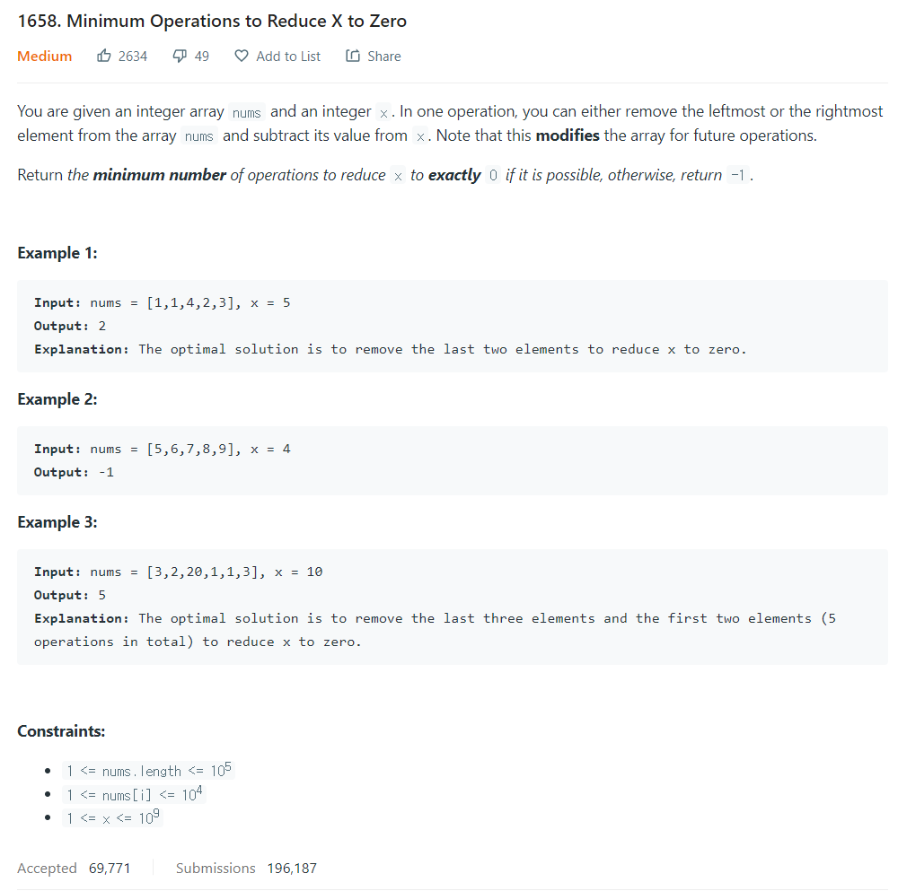

# [1. Two Sum](https://leetcode.com/problems/two-sum/)




### My Answer

```python
class Solution:
    def minOperations(self, nums: List[int], x: int) -> int:
        if sum(nums)<x : return -1
        N = [0]+nums+[0]
        A,B = 0,0
        l,r = 0,len(N)-1

        for i in range(len(N)) : 
            A += N[i]
            if A==x : 
                l=i
                break
            elif A>x : 
                A-=N[i]
                l=i-1
                break

        res=len(N)+1
        count=l
        while 0<=l<r<len(N) : 
            total = A+B
            if total==x : 
                res=min(res,count)
                A-=N[l]
                l-=1
                r-=1
                B+=N[r]
            elif total>x : 
                if l==-1 : break
                A-=N[l]
                l-=1
                count-=1
            else : 
                r-=1
                B+=N[r]
                count+=1
        return -1 if res==len(N)+1 else res
```
* Time Complexity : O(n)
* Space Complexity : O(1)


### The things I got
