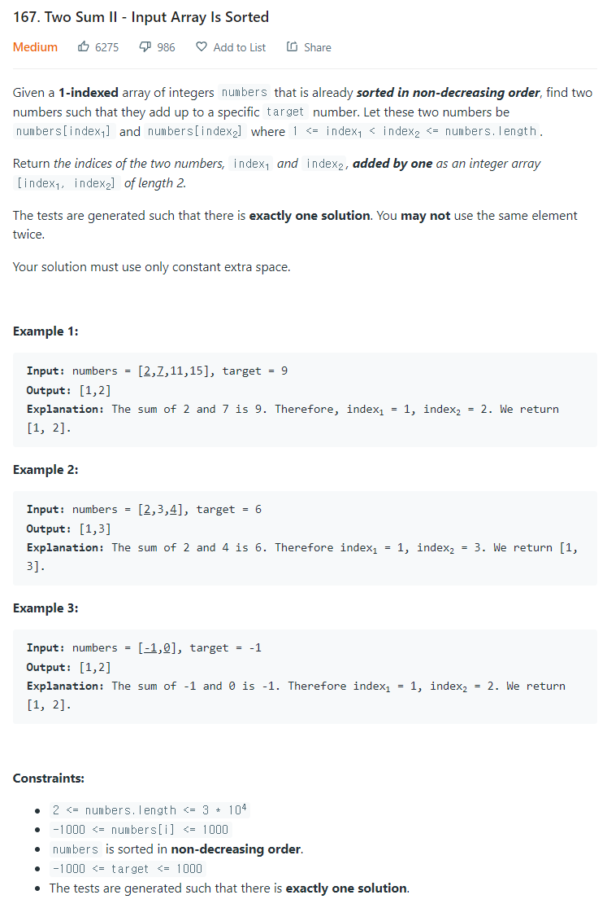

# [167. Two Sum II - Input Array Is Sorted](https://leetcode.com/problems/two-sum-ii-input-array-is-sorted/)




### My Answer

```python
class Solution:
    def twoSum(self, numbers: List[int], target: int) -> List[int]:
        l, r = 0, len(numbers)-1
        while 0<=l<r<len(numbers) : 
            s = numbers[l]+numbers[r]
            if s==target : 
                return [l+1,r+1]
            elif s>target : 
                r-=1
            else : 
                l+=1
        return [l+1,r+1]
```

* Time Complexity : O(n)
* Space Complexity : O(1)


### The things I got
