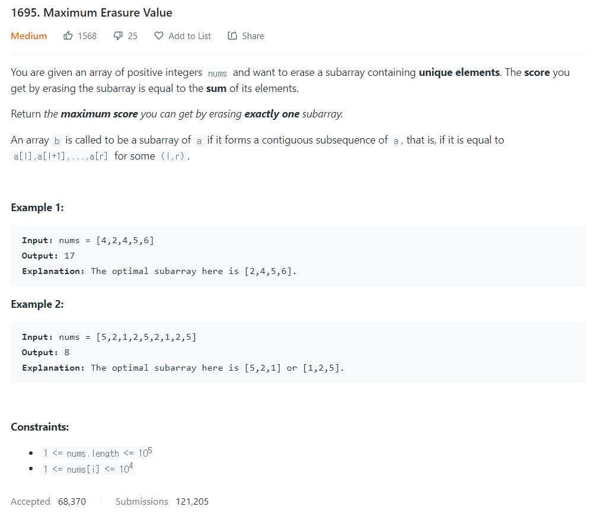

# [1. Two Sum](https://leetcode.com/problems/two-sum/)




### My Answer

```python
def maximumUniqueSubarray(self, nums: List[int]) -> int:
	D = dict()
	l,r = 0,0
	score,max_score = 0,0
	
	while 0<=l<=r<len(nums) :
		if nums[r] not in D : 
			D[nums[r]]=1
			score+=nums[r]
			max_score = max(max_score,score)
			r+=1
		else : 
			del D[nums[l]]
			score-=nums[l]
			l+=1

	return max_score
```

* Time Complexity : O(n)
* Space Complexity : O(n)


### The things I got
