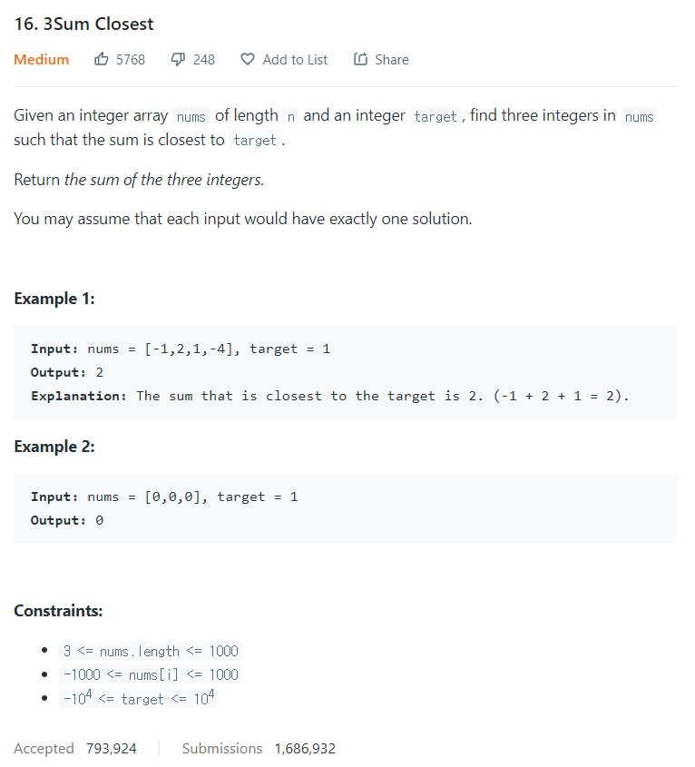

# [16. 3Sum Closest](https://leetcode.com/problems/3sum-closest/)




### My Answer

```python
class Solution:
    def threeSumClosest(self, nums: List[int], target: int) -> int:
        nums.sort()
        min_gap = 10001
        result_sum = 0
        for i in range(len(nums)-2) : 
            j,k = i+1, len(nums)-1
            while i<j<k<len(nums) : 
                triplet = nums[i]+nums[j]+nums[k]
                if triplet==target : 
                    return triplet
                
                if abs(triplet-target) < min_gap : 
                    min_gap = abs(triplet-target) 
                    result_sum = triplet
                    
                if triplet<target : 
                    j=j+1
                elif triplet>target:
                    k=k-1
        return result_sum
```

* Time Complexity : O(n^2)
* Space Complexity : O(n)


### The things I got
