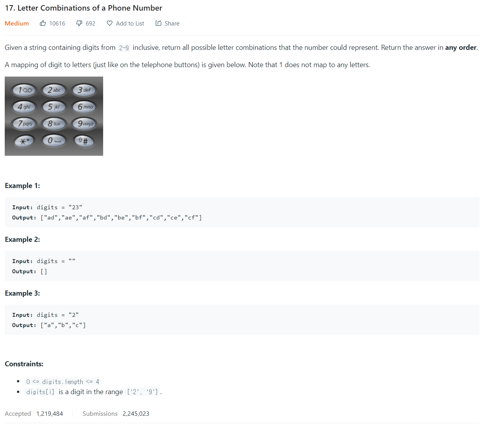

# [17. Letter Combinations of a Phone Number](https://leetcode.com/problems/letter-combinations-of-a-phone-number/)




### My Answer

```python
def letterCombinations(self, digits: str) -> List[str]:
        if len(digits)==0 : return []
        phone = {'2':'abc','3':'def','4':'ghi','5':'jkl','6':'mno','7':'pqrs','8':'tuv','9':'wxyz'}
        comb = set()
        comb.add('')
        for x in digits : 
            temp = set()
            for prev in comb : 
                for letter in phone[x] : 
                    temp.add(''.join(prev+letter))
            comb = temp
        return comb
```

* Time Complexity : O(4^n)
* Space Complexity : O(4^n)


### The things I got
