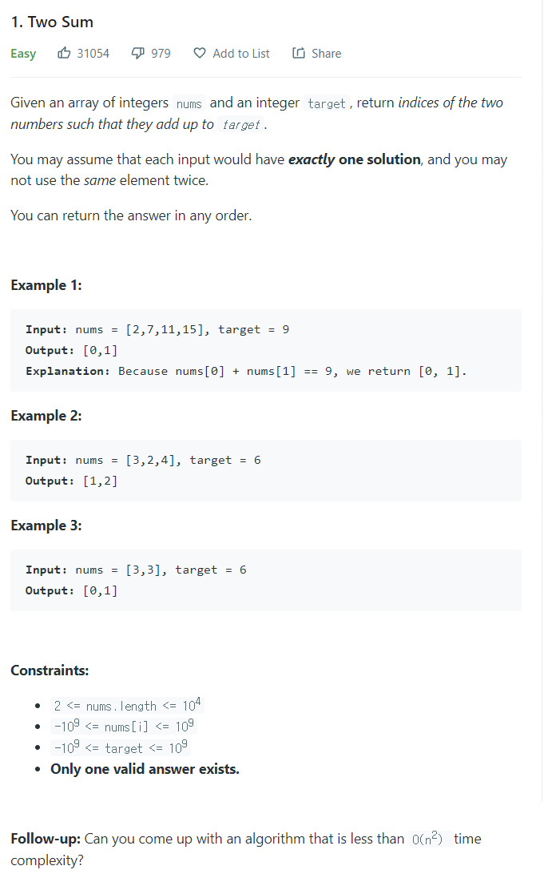

# [1. Two Sum](https://leetcode.com/problems/two-sum/)




### My Answer

```python
class Solution:
    def twoSum(self, nums: List[int], target: int) -> List[int]:
        
        from collections import defaultdict
        
        value_dict = defaultdict(int)
        
        for index in range(len(nums)) : 
            if value_dict[nums[index]]!= 0 and nums[index]*2==target : 
                return sorted([index, value_dict[nums[index]]])
            elif index and nums[index]==nums[0] and nums[index]*2==target : 
                return sorted([index, value_dict[nums[index]]])
            else : 
                value_dict[nums[index]]=index
        
        keys = list(value_dict.keys())

        for x in keys : 
            if value_dict[target-x] or (target-x)==nums[0]: 
                if target-x==x : 
                    pass
                else : 
                    return sorted([value_dict[x],value_dict[target-x]])
        
        assert(Exception("No Answer"))
```

* Time Complexity : O(2n)
* Space Complexity : O(2n)


### The things I got
