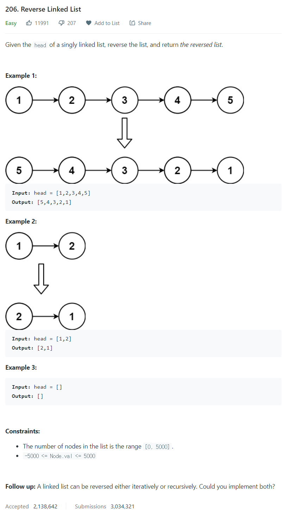

# [206. Reverse Linked List](https://leetcode.com/problems/reverse-linked-list/)




### My Answer

```python
def reverseList(self, head: Optional[ListNode]) -> Optional[ListNode]:
    prev = None
    while head : 
        curr = head
        head = head.next
        curr.next = prev
        prev = curr
	return prev
```

* Time Complexity : O(n)
* Space Complexity : O(1)


### The things I got

