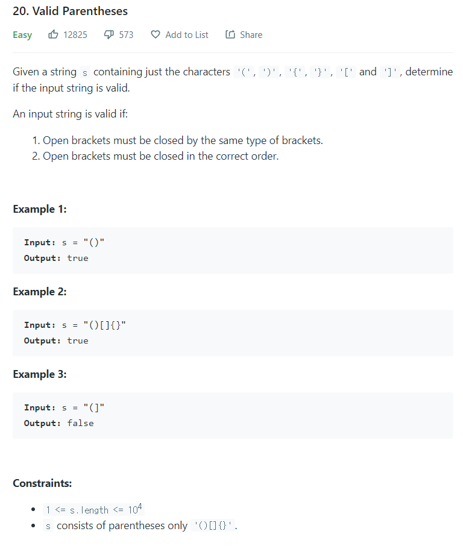

# [20. Valid Parentheses](https://leetcode.com/problems/valid-parentheses/)




### My Answer

```python
def isValid(self, s: str) -> bool:
    counterpart = {')':'(','}':'{',']':'['}
    stack = []
    for x in s : 
        if stack and x in counterpart and counterpart[x]==stack[-1] : 
            stack.pop()
        else : 
            stack.append(x)
            return False if stack else True
```

* Time Complexity : O(n)
* Space Complexity : O(n)


### The things I got
