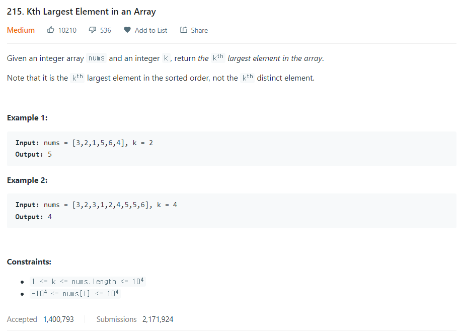

# [215. Kth Largest Element in an Array](https://leetcode.com/problems/kth-largest-element-in-an-array/)




### My Answer

```python
import heapq
class Solution:
    def findKthLargest(self, nums: List[int], k: int) -> int:
        heap = []
        for x in nums : 
            if len(heap)<k : 
                heapq.heappush(heap,x)
            elif heap[0]<x : 
                heapq.heappop(heap)
                heapq.heappush(heap,x)
            else : 
                continue
        return heapq.heappop(heap)
```

* Time Complexity : O(nlogk)
* Space Complexity : O(k)


### The things I got
